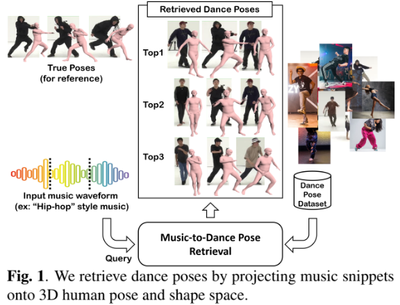

# music2danceposes
Demo code for ICASSP 2024 paper "Music-to-Dance Poses: Learning to Retrieve Dance Poses From Music"

[[Paper]](https://ieeexplore.ieee.org/abstract/document/10446425) |  [[Video Demo]](https://drive.google.com/file/d/12sKvyarUKHDga5wpW4jzCS_P8jZ-5FR0/view?usp=drive_link)

## Abstract
Choreography is an artful blend of technique and creativity, requiring the meticulous design of movement sequences in harmony with music. To support choreographers in this intricate task, this work proposes a “music-to-dance pose retrieval” system that uses music snippets to retrieve dance poses, predicts 3D human poses and shapes, and then matches them within the 3D pose and shape space. Central to our method is the EDSA adapter, a Self-Attention adapter that utilizes an Encoder-Decoder transformation, allowing a large-scale pre-trained music model to be fine-tuned effectively and efficiently for learning projection from music snippets to 3D human poses and shapes. Experimental results demonstrate that our EDSA adapter outperforms existing techniques for fine-tuning a large-scale pre-trained model in cross-modal music-to-dance pose retrieval task.

## Demo

### 1. Setup enviroment
    conda create --name edsa python=3.7.16
    source activate edsa
    pip install torch==1.12.1+cu113 torchvision==0.13.1+cu113 torchaudio==0.12.1 --extra-index-url https://download.pytorch.org/whl/cu113
    pip install librosa transformers tqdm tensorboardX tensorboard natsort moviepy

### 2. In-the-wild image files

Download and unzip the in-the-wild image files. Put two folders (CLIFF_output, image_database) under `${ROOT}`.

[in_the_wild_image_files](https://drive.google.com/file/d/1vjA9dKYP2SSe8_7IhHE2posH7Lu77Bgm/view?usp=sharing)

### 3. EDSA-adpater MERT checkpoint download

Put the checkpoint under `${ROOT}/checkpoint`.

[edsa_adapter_checkpoint](https://drive.google.com/file/d/1qhbv3KAqeN-HiBOqLoiHjWxGwRTs5_Y3/view?usp=drive_link)

### 4. Run the demo
Put your song (should be wav file) into `${ROOT}/waveform` (one song for one time).

    sh inference.sh [top-k results] [beat resolution]

* top-k results : The model generates the top-k results. [k=1,2,...]
* beat resolution : Retrieve the corresponding dance poses based on the specified beat resolution.There are several beat resolutions available for selection. [4th, 8th, 16th]

For example:

    sh inference.sh 2 4th

### 5. Retrieval results

The retrieval results and the videos for the retrieval results can be found in the 'retrieval_results_[beat resolution]' folder.

## Acknowledgements
The code is based on [MERT](https://github.com/yizhilll/MERT). Thanks for this great project.

## Citation

    @inproceedings{tseng2024music,
    title={Music-to-Dance Poses: Learning to Retrieve Dance Poses from Music},
    author={Tseng, Bo-Wei and Yang, Kenneth and Hu, Yu-Hua and Wei, Wen-Li and Lin, Jen-Chun},
    booktitle={ICASSP 2024-2024 IEEE International Conference on Acoustics, Speech and Signal Processing (ICASSP)},
    pages={8005--8009},
    year={2024},
    organization={IEEE}
    }